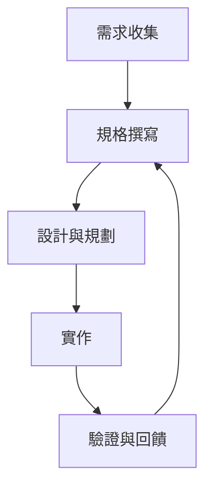

## 專案簡介

> [!TIP]
> 本專案記錄 SDD（Spec Driven Development，規格驅動開發）方法論的理論、實務經驗與相關筆記，協助團隊與個人打造高品質軟體。

SDD（Spec Driven Development，規格驅動開發）是一套強調以規格為核心、精準落實需求的軟體開發方法論。
本專案彙整作者的實務經驗，適合追求高品質、精準需求落實的軟體開發團隊與個人參考。

---

## 目錄

- [專案簡介](#專案簡介)
- [目錄](#目錄)
- [內容特色](#內容特色)
- [快速開始](#快速開始)
- [SDD 方法論概覽](#sdd-方法論概覽)
- [常見問題](#常見問題)
- [免責聲明](#免責聲明)

---

## 內容特色

- SDD 理論基礎與完整流程說明
- 規格書撰寫與驗證實務技巧
- 架構規劃與技術選型建議
- 實作經驗分享與常見問題解答

---

## 快速開始

1. 閱讀 [SDD Theory.md](./SDD%20Theory.md) 以瞭解 SDD 方法論核心概念。
2. 參考 [DataCollection.md](./DataCollection.md) 探索實務案例與經驗。
3. 根據專案需求，調整與應用 SDD 流程。

---

## SDD 方法論概覽

SDD 強調「規格先行」與「驗證導向」：

> [!NOTE]
> SDD 並非業界唯一標準，請依實際情境彈性調整。

---

## 常見問題

| 問題 | 解答 |
|---|---|
| SDD 適合哪些團隊？ | 追求高品質、需求精準落實的軟體團隊與個人 |
| 是否有標準規格書格式？ | 可依專案需求自訂，但建議明確、可驗證 |
| SDD 與 TDD 差異？ | SDD 著重規格先行，TDD 著重測試先行 |

---

## 免責聲明

本專案內容僅供參考，請依實際專案需求調整應用。

